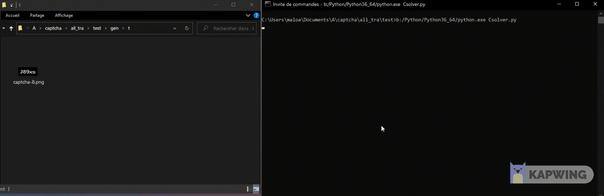

# Simple-Captcha-Solver
Simple captcha solver using locateOnScreen from pyautogui. 
Note : This script only locate captcha on screen, you cannot use an image as source for this script. 

# Exemple

 # Exemple of solver

# What type of captcha does it solve ?

The following image show the font used for captcha.

Exemple captcha can be solved with this script :

# How to use

    
    git clone https://github.com/reusteur73/Simple-Captcha-Solver.git
    unzip Simple-Captcha-Solver.zip
    cd Simple-Captcha-Solver
    python3 solver.py

It will check for the captcha on screen.

# How it works

You can set captcha_length, default is 5.

I just defined all leters and numbers of a wanted font.

Then I use locateOnScreen to find the letters and numbers of the captcha.

Then i sort coordinates of the letters and numbers to know the order of the captcha.

And then print the captcha.

# How to adapt for you

If you need this script for another font, you need to get every numbers and letters of the font. And save image of each character.

Then define it at beginning of the script.

# Caution

This script is not perfect. It can be wrong.

If the captcha has two same characters, it will not work. I recommend reload page where captcha is. Then try again.
    

